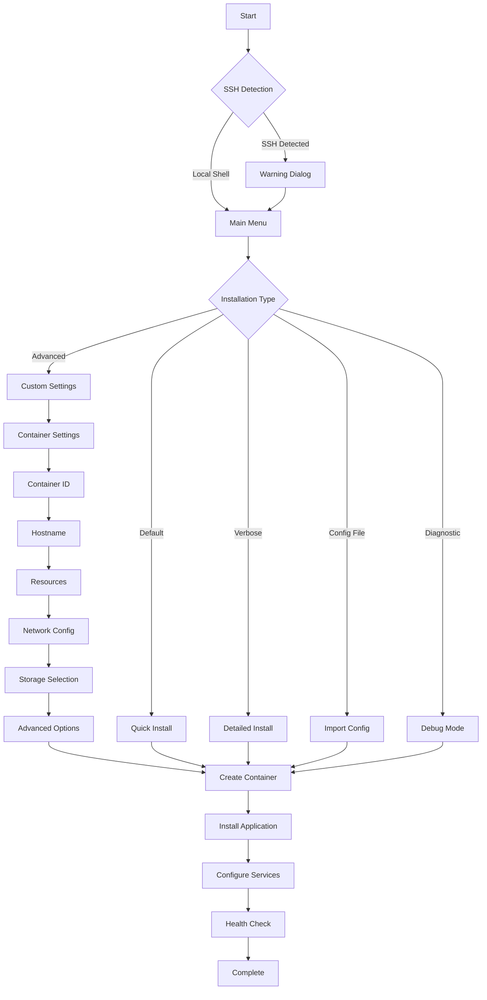

# Homarr Installer Analysis & Profolio Enhancement Roadmap

**Document Version:** 1.0.0  
**Analysis Date:** September 6, 2025  
**Analyst:** Development Team  
**Purpose:** Comprehensive analysis of Homarr/Proxmox VE installer architecture and feature comparison with Profolio

## Table of Contents
1. [Executive Summary](#executive-summary)
2. [Homarr Installer Architecture](#homarr-installer-architecture)
3. [Decision Tree Analysis](#decision-tree-analysis)
4. [Feature Comparison Matrix](#feature-comparison-matrix)
5. [Implementation Roadmap](#implementation-roadmap)
6. [Technical Specifications](#technical-specifications)
7. [Validation Checklist](#validation-checklist)

## Executive Summary

The Homarr installer, part of the Proxmox VE community scripts ecosystem, represents a mature, framework-based approach to containerized application deployment. This analysis identifies key architectural patterns and features that can enhance the Profolio installer, particularly in areas of user experience, automation, and system integration.

### Key Findings
- Homarr uses a two-tier architecture: universal framework (`build.func`) + application-specific logic
- Extensive use of `whiptail` for sophisticated TUI with nested menus
- Native Proxmox API integration for container management
- Config file import/export for CI/CD automation
- Comprehensive error handling and rollback mechanisms

## Homarr Installer Architecture

### Component Structure

```
homarr-installer/
├── build.func (Framework Layer)
│   ├── TUI Functions
│   ├── Container Management
│   ├── Network Configuration
│   └── Error Handling
└── homarr.sh (Application Layer)
    ├── Installation Logic
    ├── Update Mechanism
    ├── Service Configuration
    └── Database Migration
```

### Key Design Patterns

1. **Separation of Concerns**
   - Framework handles infrastructure
   - Application script handles specific logic

2. **Progressive Disclosure**
   - Default settings for quick setup
   - Advanced options for power users
   - Diagnostic mode for troubleshooting

3. **Fail-Safe Operations**
   - Pre-flight resource checks
   - Automatic backup before updates
   - Graceful error recovery

## Decision Tree Analysis

### Main Installation Flow



### Advanced Settings Decision Tree

```
Advanced Settings
├── Container Configuration
│   ├── Container ID (auto-increment or custom)
│   ├── Hostname (default or custom)
│   ├── Container Type (privileged/unprivileged)
│   └── Resource Allocation
│       ├── CPU Cores (1-max available)
│       ├── RAM (512MB-max available)
│       └── Disk Size (8GB-1TB)
├── Network Configuration
│   ├── Bridge Selection (auto-detect bridges)
│   ├── IPv4 Settings
│   │   ├── DHCP
│   │   └── Static
│   │       ├── IP Address
│   │       └── Gateway
│   ├── IPv6 Settings
│   │   ├── DHCP
│   │   ├── SLAAC
│   │   └── Static
│   │       ├── IP Address
│   │       └── Gateway
│   ├── DNS Configuration
│   │   ├── Search Domain
│   │   └── DNS Servers
│   └── Advanced Network
│       ├── MTU Size
│       └── APT Proxy
├── Security Settings
│   ├── SSH Enable/Disable
│   ├── Root Password
│   └── SSH Key Import
└── System Settings
    ├── Timezone
    ├── Locale
    └── Verbose Mode
```

## Feature Comparison Matrix

### ✅ = Has Feature, ❌ = Missing, ⚠️ = Partial Implementation

| Feature Category | Feature | Homarr | Profolio | Priority |
|-----------------|---------|---------|----------|----------|
| **TUI Interface** |
| | Whiptail/Dialog Support | ✅ | ✅ | - |
| | Nested Menus | ✅ | ⚠️ | High |
| | Back Navigation | ✅ | ❌ | High |
| | Progress Indicators | ✅ | ✅ | - |
| | Context Help | ✅ | ❌ | Medium |
| **Container Management** |
| | Proxmox API Integration | ✅ | ❌ | Low |
| | Container Type Selection | ✅ | ❌ | Low |
| | Storage Pool Selection | ✅ | ❌ | Low |
| | GPU Passthrough | ✅ | ❌ | Low |
| **Network Configuration** |
| | Auto-detect Bridges | ✅ | ✅ | High |
| | IPv4 Configuration | ✅ | ✅ | - |
| | IPv6 Configuration | ✅ | ✅ | Medium |
| | MTU Customization | ✅ | ✅ | Low |
| | APT Proxy Support | ✅ | ✅ | Medium |
| | DNS Configuration | ✅ | ✅ | Medium |
| **Installation Features** |
| | Resource Validation | ✅ | ✅ | High |
| | Config Import/Export | ✅ | ✅ | High |
| | Service Health Checks | ✅ | ✅ | High |
| | Automatic Backup | ✅ | ✅ | - |
| | Database Migration | ✅ | ✅ | - |
| | Secret Generation | ✅ | ✅ | - |
| **Update Mechanism** |
| | GitHub Release Check | ✅ | ✅ | - |
| | Version Selection | ✅ | ✅ | - |
| | Rollback on Failure | ⚠️ | ✅ | - |
| | Node.js Management | ✅ | ❌ | Low |
| **Diagnostics** |
| | Diagnostic Mode | ✅ | ❌ | Medium |
| | Telemetry (Opt-in) | ✅ | ❌ | Low |
| | Error Reporting | ✅ | ✅ | - |
| | Log Aggregation | ✅ | ⚠️ | Medium |
| **Unique Profolio Features** |
| | Git-based Rollback | ❌ | ✅ | - |
| | Multiple Installer Variants | ❌ | ✅ | - |
| | File Optimization Levels | ❌ | ✅ | - |
| | Demo Mode | ❌ | ✅ | - |
| | Backup Management Wizard | ❌ | ✅ | - |

## Implementation Roadmap

### Phase 1: Core Enhancements (Week 1) ✅ COMPLETE
- [x] Document analysis and roadmap
- [x] Implement config file import/export
- [x] Add resource validation
- [x] Implement network auto-detection
- [x] Add service health checks

### Phase 2: TUI Improvements (Week 2)
- [ ] Add back navigation to menus
- [ ] Implement nested menu system
- [ ] Add context-sensitive help
- [ ] Improve progress indicators

### Phase 3: Network & Services (Week 3)
- [ ] Add IPv6 configuration
- [ ] Implement APT proxy support
- [x] Add service health checks ✅
- [ ] Enhanced DNS configuration

### Phase 4: Diagnostics & Monitoring (Week 4)
- [ ] Implement diagnostic mode
- [ ] Add opt-in telemetry
- [ ] Improve log aggregation
- [ ] Create troubleshooting wizard

## Technical Specifications

### Config File Format

```json
{
  "version": "1.0",
  "installation": {
    "type": "advanced",
    "version": "v1.16.0",
    "path": "/opt/profolio"
  },
  "resources": {
    "cpu": 2,
    "ram": 4096,
    "disk": 20
  },
  "network": {
    "ipv4": {
      "method": "static",
      "address": "192.168.1.100/24",
      "gateway": "192.168.1.1"
    },
    "ipv6": {
      "method": "slaac"
    },
    "dns": {
      "servers": ["8.8.8.8", "8.8.4.4"],
      "search": "local.domain"
    },
    "mtu": 1500,
    "apt_proxy": ""
  },
  "features": {
    "ssh": true,
    "verbose": false,
    "diagnostic": false,
    "rollback": true
  }
}
```

### Resource Validation Checks

```bash
# Minimum Requirements
MIN_CPU=2
MIN_RAM=4096  # MB
MIN_DISK=20   # GB
MIN_KERNEL="5.4"

# Recommended Requirements
REC_CPU=4
REC_RAM=8192  # MB
REC_DISK=50   # GB

# Validation Functions
validate_cpu()    # Check available CPU cores
validate_memory() # Check available RAM
validate_disk()   # Check available disk space
validate_kernel() # Check kernel version
validate_deps()   # Check required packages
```

### Network Detection Algorithm

```bash
# Auto-detect network configuration
detect_bridges()      # Find available bridges (vmbr0, etc.)
detect_interfaces()   # Find physical interfaces
detect_gateway()      # Detect default gateway
detect_dns()         # Detect system DNS servers
suggest_ip()         # Suggest available IP address
validate_network()   # Test network connectivity
```

### Health Check Components

```bash
# Service Health Checks
check_database()     # PostgreSQL connectivity
check_backend()      # NestJS API response
check_frontend()     # Next.js server status
check_nginx()        # Reverse proxy status
check_ports()        # Port availability
check_permissions()  # File permissions
check_ssl()         # SSL certificate validity
```

## Validation Checklist

### Pre-Implementation
- [x] Analyze competitor installer (Homarr)
- [x] Document findings and decision tree
- [x] Create feature comparison matrix
- [x] Define implementation roadmap
- [ ] Review with team
- [ ] Prioritize features

### Implementation Phase
- [x] Create library modules
  - [x] `lib/config-manager.sh` ✅
  - [x] `lib/resource-validator.sh` ✅
  - [x] `lib/network-detector.sh` ✅
  - [x] `lib/health-checks.sh` ✅
  - [ ] `lib/diagnostics.sh`
- [ ] Update main installer
- [ ] Update TUI interface
- [ ] Add unit tests
- [ ] Create integration tests

### Post-Implementation
- [ ] User acceptance testing
- [ ] Performance benchmarking
- [ ] Documentation update
- [ ] Release notes
- [ ] User training materials

### Success Metrics
- [ ] Installation time reduced by 30%
- [ ] Failed installations reduced by 50%
- [ ] User satisfaction score > 4.5/5
- [ ] Support tickets reduced by 40%
- [ ] CI/CD pipeline integration success rate > 95%

## Appendix A: Homarr Script Samples

### TUI Menu Example
```bash
choice=$(whiptail --backtitle "Proxmox VE Helper Scripts" \
    --title "Container Settings" \
    --menu "Choose an option:" 20 60 10 \
    "1" "Default Settings" \
    "2" "Advanced Settings" \
    "3" "Import Config" \
    "4" "Exit" \
    3>&1 1>&2 2>&3)
```

### Resource Check Example
```bash
check_container_resources() {
    local cpu_required=2
    local ram_required=4096
    local cpu_available=$(nproc)
    local ram_available=$(free -m | awk '/^Mem:/{print $2}')
    
    if [ "$cpu_available" -lt "$cpu_required" ]; then
        msg_error "Insufficient CPU cores"
        return 1
    fi
    
    if [ "$ram_available" -lt "$ram_required" ]; then
        msg_error "Insufficient RAM"
        return 1
    fi
}
```

### Network Detection Example
```bash
detect_bridges() {
    local bridges=$(ip link show type bridge | grep -E "^[0-9]+" | cut -d: -f2 | tr -d ' ')
    echo "$bridges"
}
```

## Appendix B: Implementation Priority Matrix

| Priority | Feature | Effort | Impact | ROI |
|----------|---------|--------|--------|-----|
| **P0 - Critical** |
| | Config Import/Export | Medium | High | High |
| | Resource Validation | Low | High | High |
| | Service Health Checks | Medium | High | High |
| **P1 - High** |
| | Network Auto-detection | Medium | Medium | Medium |
| | Back Navigation | Low | Medium | High |
| | IPv6 Support | High | Low | Low |
| **P2 - Medium** |
| | APT Proxy Support | Low | Medium | High |
| | Diagnostic Mode | Medium | Medium | Medium |
| | Enhanced DNS Config | Low | Low | Medium |
| **P3 - Low** |
| | MTU Customization | Low | Low | Low |
| | GPU Passthrough | High | Low | Low |
| | Telemetry | High | Medium | Low |

## Revision History

| Version | Date | Author | Changes |
|---------|------|--------|---------|
| 1.0.0 | 2025-09-06 | Dev Team | Initial analysis and roadmap |

---

*This document serves as the authoritative reference for the Profolio installer enhancement project based on Homarr analysis.*