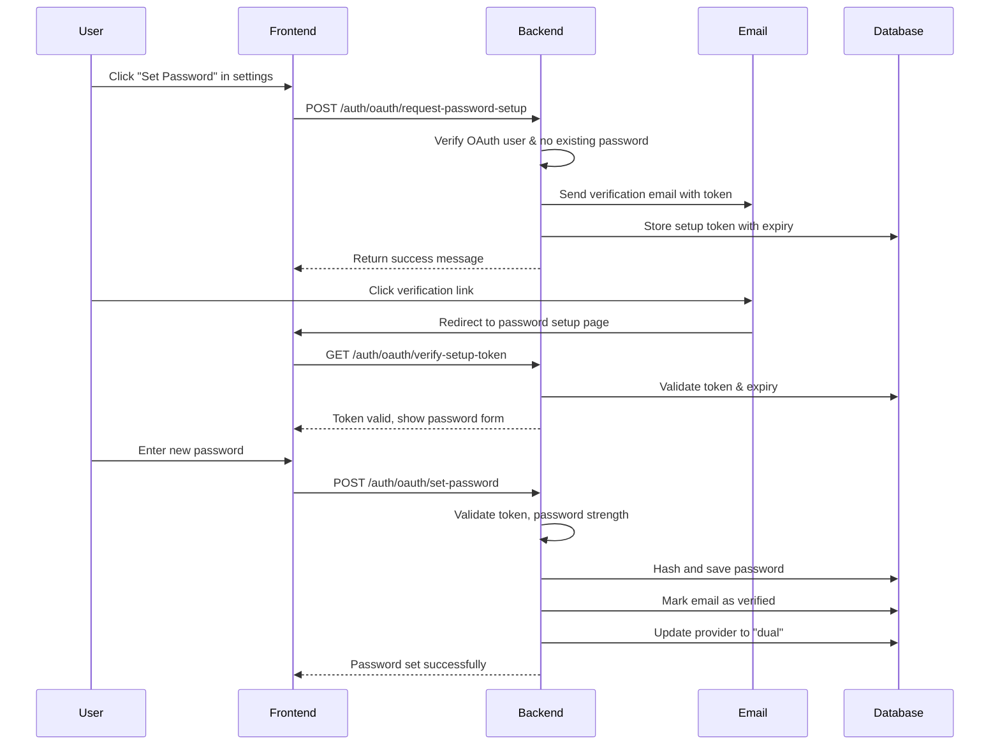

# OAuth Users Password Management Specification

## 1. Executive Summary

This project enables OAuth-authenticated users (Google, GitHub, Firebase) to set up email/password authentication as an additional login method. This addresses a critical gap where OAuth users cannot enable 2FA (which requires a password) and provides fallback authentication if OAuth providers are unavailable.

**Key Benefits:**

- OAuth users can enable 2FA (currently blocked)
- Dual authentication methods (OAuth + email/password)
- Account recovery options for OAuth users
- Improved security posture with password-protected features
- Business continuity if OAuth providers have outages

**Estimated Effort:** 3-4 days
**Complexity:** Medium
**Priority:** High (Security Critical)

## 2. Current State Analysis

### 2.1 Authentication Flow

Currently, the system supports two authentication paths:

1. **Local Authentication:**
   - Users sign up with email/password
   - Password is hashed with bcrypt (12 rounds)
   - Can enable 2FA (requires password verification)
   - Can change password (requires current password)

2. **OAuth Authentication (Firebase):**
   - Users sign in via Google/GitHub through Firebase
   - User created with empty password (`password: ""`)
   - Provider field set to "firebase"
   - Cannot enable 2FA (requires password)
   - Cannot use email/password login

### 2.2 Database Schema

```prisma
model User {
  id                String         @id @default(cuid())
  email             String         @unique
  password          String         // Empty for OAuth users
  provider          String?        // "local" or "firebase"
  emailVerified     Boolean        @default(false)
  // ... other fields
}
```

### 2.3 Current Limitations

1. **2FA Blocker:** OAuth users cannot enable 2FA as it requires password verification
2. **No Fallback:** If OAuth provider is down, users cannot access their accounts
3. **Feature Restrictions:** Password-protected features unavailable to OAuth users
4. **Security Gap:** No way to add additional security layer for OAuth accounts

### 2.4 Code References

- Firebase token exchange: `backend/src/app/api/auth/auth.controller.ts:318-418`
- OAuth user creation: `backend/src/app/api/auth/auth.controller.ts:366`
- 2FA password check: `backend/src/app/api/auth/auth.controller.ts:447-449`
- Password field for OAuth: Empty string on line 366

## 3. Proposed Solution

### 3.1 High-Level Flow



### 3.2 Security Requirements

1. **Email Verification Required**
   - Must verify email ownership before allowing password setup
   - Prevents account takeover attempts
   - One-time use verification tokens

2. **Token Security**
   - Cryptographically secure random tokens (32 bytes)
   - 1-hour expiry for setup tokens
   - Single-use tokens (invalidated after use)
   - Stored hashed in database

3. **Rate Limiting**
   - Max 3 password setup requests per hour per email
   - Max 5 verification attempts per token
   - Progressive delays on failed attempts

4. **Password Requirements**
   - Minimum 12 characters
   - At least 1 uppercase, 1 lowercase, 1 number, 1 special character
   - Cannot contain email address
   - Check against common passwords list
   - zxcvbn score >= 3

5. **Audit Logging**
   - Log all password setup attempts
   - Log successful password sets
   - Include IP address, user agent, timestamp

### 3.3 Provider Status Model

After implementation, users will have these provider states:

- `"local"` - Traditional email/password only
- `"firebase"` - OAuth only (Google/GitHub via Firebase)
- `"dual"` - Both OAuth and email/password enabled

## 4. Technical Architecture

### 4.0 Type Safety & Code Quality Requirements

**CRITICAL: All code must be 100% type-safe with ZERO `any` types**

#### Type Safety Requirements:

- **NO `any` types** - Use `unknown` with type guards or proper interfaces
- All function parameters must have explicit types
- All API responses must have defined interfaces
- All event handlers must be properly typed
- Use strict TypeScript configuration (`strict: true`)
- Enable all ESLint rules for type checking

#### ESLint Compliance:

- Code must pass `pnpm lint:strict` with zero warnings
- Use `AuthenticatedRequest` interface for all authenticated endpoints
- Import type utilities from `@/types/common`
- Follow existing patterns in codebase

#### Race Condition Prevention:

Based on recent Google sign-in fix, implement:

- **State flags** to prevent premature auth checks during operations
- **Proper delays** to ensure auth state propagation
- **Replace vs Push** routing to prevent back button issues
- **Abort controllers** for cancellable operations
- **Mounted refs** to prevent state updates on unmounted components

### 4.1 New Database Tables

```prisma
model PasswordSetupToken {
  id          String   @id @default(cuid())
  userId      String
  token       String   @unique // Hashed token
  expiresAt   DateTime
  used        Boolean  @default(false)
  attempts    Int      @default(0)
  createdAt   DateTime @default(now())

  user        User     @relation(fields: [userId], references: [id])

  @@index([token])
  @@index([userId])
  @@index([expiresAt])
}
```

### 4.2 Service Architecture

```typescript
import { Injectable, HttpException, HttpStatus } from "@nestjs/common";
import { PrismaService } from "@/common/prisma.service";
import { EmailService } from "@/common/email.service";
import { hash } from "bcrypt";
import { randomBytes } from "crypto";
import { AuthenticatedRequest } from "@/types/common";

interface PasswordSetupTokenData {
  id: string;
  userId: string;
  token: string;
  expiresAt: Date;
  used: boolean;
  attempts: number;
}

interface SetupTokenValidation {
  valid: boolean;
  email: string;
  expiresIn: number;
}

interface PasswordSetupResult {
  success: boolean;
  message: string;
  provider: "dual";
}

@Injectable()
export class OAuthPasswordService {
  private readonly MAX_ATTEMPTS = 5;
  private readonly TOKEN_EXPIRY_HOURS = 1;
  private readonly BCRYPT_ROUNDS = 12;

  constructor(
    private readonly prisma: PrismaService,
    private readonly emailService: EmailService,
  ) {}

  async requestPasswordSetup(userId: string): Promise<void> {
    // Implementation with proper types
  }

  async verifySetupToken(token: string): Promise<SetupTokenValidation> {
    // Implementation with proper types
  }

  async setPassword(
    token: string,
    password: string,
    confirmPassword: string,
  ): Promise<PasswordSetupResult> {
    // Implementation with proper types
  }

  private generateSecureToken(): string {
    return randomBytes(32).toString("hex");
  }

  private async hashToken(token: string): Promise<string> {
    return hash(token, 10);
  }

  private validatePasswordStrength(password: string, email: string): boolean {
    // zxcvbn integration with proper typing
    return true;
  }
}
```

### 4.3 Email Templates

**Subject:** Set up password for your Profolio account

**Body:**

```
Hi [Name],

You've requested to set up a password for your Profolio account.
This will allow you to sign in with your email and password in
addition to [Google/GitHub].

Click the link below to set your password:
[LINK - expires in 1 hour]

If you didn't request this, please ignore this email.

Security tip: Choose a unique password you don't use elsewhere.

Best regards,
The Profolio Team
```

## 5. API Endpoints & DTOs

### 5.0 Data Transfer Objects (DTOs)

```typescript
// backend/src/app/api/auth/dto/oauth-password.dto.ts

import {
  IsString,
  MinLength,
  IsEmail,
  Matches,
  IsNotEmpty,
} from "class-validator";
import { ApiProperty } from "@nestjs/swagger";

export class RequestPasswordSetupDto {
  // No body needed - user identified by JWT
}

export class VerifySetupTokenDto {
  @ApiProperty({ description: "Setup token from email" })
  @IsString()
  @IsNotEmpty()
  token: string;
}

export class SetPasswordDto {
  @ApiProperty({ description: "Setup token from email" })
  @IsString()
  @IsNotEmpty()
  token: string;

  @ApiProperty({ description: "New password", minimum: 12 })
  @IsString()
  @MinLength(12)
  @Matches(/^(?=.*[a-z])(?=.*[A-Z])(?=.*\d)(?=.*[@$!%*?&])[A-Za-z\d@$!%*?&]/, {
    message:
      "Password must contain uppercase, lowercase, number and special character",
  })
  password: string;

  @ApiProperty({ description: "Password confirmation" })
  @IsString()
  @IsNotEmpty()
  confirmPassword: string;
}

// Response DTOs
export class TokenValidationResponse {
  valid: boolean;
  email: string;
  expiresIn: number; // seconds
}

export class PasswordSetupResponse {
  success: boolean;
  message: string;
  provider: "dual";
}
```

## 5. API Endpoints

### 5.1 Request Password Setup

**Endpoint:** `POST /api/auth/oauth/request-password-setup`

**Request:**

```json
{
  // No body needed, user identified by JWT
}
```

**Response:**

```json
{
  "success": true,
  "message": "Password setup email sent to your registered email address"
}
```

**Error Cases:**

- 400: User already has a password
- 400: User is not an OAuth user
- 429: Too many requests (rate limited)

### 5.2 Verify Setup Token

**Endpoint:** `GET /api/auth/oauth/verify-setup-token/:token`

**Response:**

```json
{
  "valid": true,
  "email": "user@example.com",
  "expiresIn": 3542 // seconds
}
```

**Error Cases:**

- 400: Invalid or expired token
- 429: Too many verification attempts

### 5.3 Set Password

**Endpoint:** `POST /api/auth/oauth/set-password`

**Request:**

```json
{
  "token": "setup_token_here",
  "password": "NewSecurePassword123!",
  "confirmPassword": "NewSecurePassword123!"
}
```

**Response:**

```json
{
  "success": true,
  "message": "Password set successfully. You can now sign in with email and password.",
  "provider": "dual"
}
```

**Error Cases:**

- 400: Invalid or expired token
- 400: Passwords don't match
- 400: Password doesn't meet requirements
- 409: Password already set

## 6. Frontend Implementation

### 6.1 Settings Page Addition

```tsx
// In SecuritySettings component
{
  user.provider === "firebase" && !user.hasPassword && (
    <Card>
      <CardHeader>
        <CardTitle>Set Up Password</CardTitle>
        <CardDescription>
          Add email/password login to your account
        </CardDescription>
      </CardHeader>
      <CardContent>
        <p>Currently, you sign in with {user.authProvider}.</p>
        <p>Setting up a password will allow you to:</p>
        <ul>
          <li>Sign in with email and password</li>
          <li>Enable two-factor authentication</li>
          <li>Access your account if {user.authProvider} is unavailable</li>
        </ul>
        <Button onClick={handleRequestPasswordSetup}>Set Up Password</Button>
      </CardContent>
    </Card>
  );
}
```

### 6.2 Password Setup Flow (with Race Condition Prevention)

```tsx
"use client";

import { useState, useEffect, useRef } from "react";
import { useRouter, useSearchParams } from "next/navigation";
import { apiClient } from "@/lib/api-client";

interface TokenValidation {
  valid: boolean;
  email: string;
  expiresIn: number;
}

const SetupPasswordPage: React.FC = () => {
  const searchParams = useSearchParams();
  const token = searchParams.get("token");
  const router = useRouter();

  // State management with proper types
  const [password, setPassword] = useState<string>("");
  const [confirmPassword, setConfirmPassword] = useState<string>("");
  const [strength, setStrength] = useState<number>(0);
  const [loading, setLoading] = useState<boolean>(false);
  const [error, setError] = useState<string | null>(null);
  const [tokenValid, setTokenValid] = useState<boolean>(false);
  const [email, setEmail] = useState<string>("");

  // Race condition prevention
  const [isPasswordSetupInProgress, setIsPasswordSetupInProgress] =
    useState<boolean>(false);
  const [hasCompletedSetup, setHasCompletedSetup] = useState<boolean>(false);
  const mountedRef = useRef<boolean>(true);
  const abortControllerRef = useRef<AbortController | null>(null);

  // Cleanup on unmount
  useEffect(() => {
    return () => {
      mountedRef.current = false;
      if (abortControllerRef.current) {
        abortControllerRef.current.abort();
      }
    };
  }, []);

  // Verify token on mount with proper error handling
  useEffect(() => {
    const verifyToken = async (): Promise<void> => {
      if (!token || hasCompletedSetup) return;

      try {
        // Cancel any existing request
        if (abortControllerRef.current) {
          abortControllerRef.current.abort();
        }
        abortControllerRef.current = new AbortController();

        const response = await apiClient.get<TokenValidation>(
          `/auth/oauth/verify-setup-token/${token}`,
          { signal: abortControllerRef.current.signal },
        );

        if (mountedRef.current && response.valid) {
          setTokenValid(true);
          setEmail(response.email);
        } else if (mountedRef.current) {
          setError("Invalid or expired token");
        }
      } catch (err) {
        if (
          mountedRef.current &&
          err instanceof Error &&
          err.name !== "AbortError"
        ) {
          setError("Failed to verify token");
        }
      }
    };

    verifyToken();
  }, [token, hasCompletedSetup]);

  // Real-time password strength with proper typing
  useEffect(() => {
    if (password) {
      // Import zxcvbn dynamically to reduce bundle size
      import("zxcvbn").then(({ default: zxcvbn }) => {
        const result = zxcvbn(password, [email]);
        setStrength(result.score);
      });
    } else {
      setStrength(0);
    }
  }, [password, email]);

  const handleSetPassword = async (
    e: React.FormEvent<HTMLFormElement>,
  ): Promise<void> => {
    e.preventDefault();

    if (isPasswordSetupInProgress || hasCompletedSetup) return;

    setError(null);
    setLoading(true);
    setIsPasswordSetupInProgress(true);

    try {
      const response = await apiClient.post<PasswordSetupResult>(
        "/auth/oauth/set-password",
        {
          token,
          password,
          confirmPassword,
        },
      );

      if (response.success) {
        setHasCompletedSetup(true);

        // Add delay to ensure auth state propagates
        setTimeout(() => {
          // Use replace to prevent back button to setup page
          router.replace("/app/settings/security?passwordSetupSuccess=true");
        }, 500);
      }
    } catch (err) {
      if (mountedRef.current) {
        setError(err instanceof Error ? err.message : "Failed to set password");
        setIsPasswordSetupInProgress(false);
      }
    } finally {
      if (mountedRef.current) {
        setLoading(false);
      }
    }
  };

  if (!tokenValid) {
    return <TokenInvalidView error={error} />;
  }

  return (
    <form onSubmit={handleSetPassword} className="space-y-4">
      <PasswordInput
        value={password}
        onChange={(e: React.ChangeEvent<HTMLInputElement>) =>
          setPassword(e.target.value)
        }
        strength={strength}
        showRequirements
        disabled={loading || hasCompletedSetup}
      />
      <PasswordInput
        value={confirmPassword}
        onChange={(e: React.ChangeEvent<HTMLInputElement>) =>
          setConfirmPassword(e.target.value)
        }
        label="Confirm Password"
        disabled={loading || hasCompletedSetup}
      />
      {error && <ErrorAlert message={error} />}
      <Button
        type="submit"
        disabled={
          loading ||
          hasCompletedSetup ||
          strength < 3 ||
          password !== confirmPassword ||
          password.length < 12
        }
      >
        {loading ? "Setting Password..." : "Set Password"}
      </Button>
    </form>
  );
};
```

### 6.3 Success State

After successful password setup:

1. Show success message
2. Update user context to reflect dual authentication
3. Enable 2FA setup option if not already enabled
4. Redirect to security settings

## 7. Security Considerations

### 7.1 Attack Vectors & Mitigations

| Attack Vector              | Mitigation                                   |
| -------------------------- | -------------------------------------------- |
| Account takeover via email | Email verification required                  |
| Token guessing             | 256-bit cryptographically secure tokens      |
| Token replay               | Single-use tokens                            |
| Brute force                | Rate limiting, account lockout               |
| Weak passwords             | Strong password requirements, zxcvbn scoring |
| Token interception         | HTTPS only, short expiry (1 hour)            |
| Email enumeration          | Same response for all requests               |

### 7.2 Privacy Considerations

- Don't reveal whether email exists in system
- Don't indicate if user is OAuth or local
- Generic error messages to prevent information leakage
- Secure token storage (hashed, not plaintext)

### 7.3 Compliance

- GDPR: User-initiated action, proper consent
- Password storage: bcrypt with 12+ rounds
- Audit trail for security events
- Allow users to remove password later

## 8. Testing Strategy

### 8.1 Unit Tests

```typescript
describe("OAuthPasswordService", () => {
  test("should generate unique secure tokens");
  test("should hash tokens before storage");
  test("should validate token expiry");
  test("should enforce single-use tokens");
  test("should validate password strength");
  test("should update provider to dual");
  test("should handle race conditions");
});
```

### 8.2 Integration Tests

```typescript
describe("OAuth Password Setup Flow", () => {
  test("complete flow from request to password set");
  test("rate limiting enforcement");
  test("token expiry handling");
  test("duplicate request handling");
  test("concurrent request handling");
});
```

### 8.3 E2E Tests

```typescript
describe("OAuth Password Setup E2E", () => {
  test("user can request password setup from settings");
  test("email is received with valid link");
  test("token verification and password form display");
  test("password strength validation");
  test("successful password setup and dual auth");
  test("user can login with both methods after setup");
  test("2FA can be enabled after password setup");
});
```

### 8.4 Security Testing

- Penetration testing for token prediction
- Rate limiting effectiveness
- SQL injection attempts
- XSS in password setup form
- CSRF protection validation

## 9. Migration Plan

### 9.1 Database Migration

```sql
-- Create PasswordSetupToken table
CREATE TABLE "PasswordSetupToken" (
    "id" TEXT NOT NULL PRIMARY KEY,
    "userId" TEXT NOT NULL,
    "token" TEXT NOT NULL UNIQUE,
    "expiresAt" TIMESTAMP NOT NULL,
    "used" BOOLEAN DEFAULT false,
    "attempts" INTEGER DEFAULT 0,
    "createdAt" TIMESTAMP DEFAULT CURRENT_TIMESTAMP,
    FOREIGN KEY ("userId") REFERENCES "User"("id")
);

CREATE INDEX idx_token ON "PasswordSetupToken"("token");
CREATE INDEX idx_userId ON "PasswordSetupToken"("userId");
CREATE INDEX idx_expiresAt ON "PasswordSetupToken"("expiresAt");

-- Add hasPassword computed field (virtual)
-- No schema change needed, compute from password !== ''
```

### 9.2 Deployment Steps

1. **Phase 1: Backend Deployment**
   - Deploy new endpoints (disabled by feature flag)
   - Run database migrations
   - Test in staging environment

2. **Phase 2: Frontend Deployment**
   - Deploy UI components (hidden by feature flag)
   - Test complete flow in staging

3. **Phase 3: Gradual Rollout**
   - Enable for 10% of OAuth users
   - Monitor metrics and errors
   - Gradually increase to 100%

4. **Phase 4: Full Launch**
   - Enable for all OAuth users
   - Update documentation
   - Notify users via email/in-app

### 9.3 Rollback Plan

If issues arise:

1. Disable feature flag immediately
2. Password setup tokens expire naturally (1 hour)
3. Existing passwords remain functional
4. No data loss or corruption risk

## 10. Success Metrics

### 10.1 Adoption Metrics

- % of OAuth users who set up passwords
- Time from notification to setup completion
- Drop-off rate in setup flow
- 2FA enablement rate post-password setup

### 10.2 Security Metrics

- Failed setup attempts (potential attacks)
- Token expiry rate
- Password strength distribution
- Account recovery usage

### 10.3 Technical Metrics

- API response times
- Email delivery success rate
- Error rates by endpoint
- Database query performance

### 10.4 Success Criteria

- 30% of OAuth users set up passwords within 30 days
- <1% error rate in setup flow
- Zero security incidents related to feature
- 95% user satisfaction (via survey)

## 11. Risk Assessment

### 11.1 Technical Risks

| Risk                    | Likelihood | Impact | Mitigation                                |
| ----------------------- | ---------- | ------ | ----------------------------------------- |
| Email delivery failures | Medium     | High   | Retry mechanism, multiple providers       |
| Token collision         | Very Low   | High   | Use crypto.randomBytes(32)                |
| Database performance    | Low        | Medium | Proper indexing, token cleanup job        |
| Race conditions         | Low        | Medium | Database transactions, unique constraints |

### 11.2 Security Risks

| Risk               | Likelihood | Impact   | Mitigation                        |
| ------------------ | ---------- | -------- | --------------------------------- |
| Account takeover   | Low        | Critical | Email verification, rate limiting |
| Weak passwords     | Medium     | High     | Strong requirements, zxcvbn       |
| Token interception | Low        | High     | HTTPS, short expiry               |
| Brute force        | Medium     | Medium   | Rate limiting, account lockout    |

### 11.3 Business Risks

| Risk           | Likelihood | Impact | Mitigation                      |
| -------------- | ---------- | ------ | ------------------------------- |
| Low adoption   | Medium     | Medium | User education, clear benefits  |
| User confusion | Medium     | Low    | Clear UI/UX, help documentation |
| Support burden | Medium     | Medium | FAQ, automated help             |

## 12. Timeline & Milestones

### Day 1: Foundation

- [ ] Create database migration
- [ ] Implement OAuthPasswordService
- [ ] Add API endpoints
- [ ] Write unit tests

### Day 2: Integration

- [ ] Email service integration
- [ ] Frontend components
- [ ] Password strength calculator
- [ ] Integration tests

### Day 3: Polish & Security

- [ ] Security review
- [ ] Rate limiting implementation
- [ ] E2E tests
- [ ] Documentation

### Day 4: Deployment

- [ ] Staging deployment
- [ ] Security testing
- [ ] Performance testing
- [ ] Production deployment (feature flagged)

## 13. Future Enhancements

After successful implementation, consider:

1. **Password-less Setup**: Magic link authentication
2. **Passkey Support**: WebAuthn for modern browsers
3. **Social Recovery**: Trusted contacts for account recovery
4. **Advanced 2FA**: Support for hardware keys
5. **Password Rotation**: Enforce periodic password changes
6. **Breach Monitoring**: Check passwords against breach databases

## 14. Documentation Requirements

### 14.1 User Documentation

- Help article: "How to set up a password for OAuth accounts"
- FAQ: Common questions about dual authentication
- Security guide: Best practices for password creation

### 14.2 Developer Documentation

- API documentation with examples
- Architecture decision records (ADRs)
- Troubleshooting guide

### 14.3 Support Documentation

- Common issues and resolutions
- Escalation procedures
- Security incident response

## 15. Approval & Sign-off

### Stakeholders

- [ ] Engineering Lead
- [ ] Security Team
- [ ] Product Manager
- [ ] UX Designer

### Review Checklist

- [ ] Security review completed
- [ ] Privacy impact assessment done
- [ ] Performance impact acceptable
- [ ] User experience validated
- [ ] Documentation complete

---

**Document Version:** 1.1
**Created:** January 2025
**Last Updated:** January 2025
**Author:** Profolio Engineering Team
**Status:** Ready for Implementation

## 16. Implementation Checklist

### Backend Tasks (NestJS)

- [ ] Create database migration for PasswordSetupToken table
- [ ] Create oauth-password.dto.ts with proper validation
- [ ] Implement OAuthPasswordService with type-safe methods
- [ ] Add rate limiting middleware for password setup endpoints
- [ ] Create email templates for password setup
- [ ] Add API endpoints in auth.controller.ts
- [ ] Write unit tests for OAuthPasswordService
- [ ] Write integration tests for API endpoints
- [ ] Add audit logging for security events
- [ ] Implement token cleanup job (remove expired tokens)

### Frontend Tasks (Next.js)

- [ ] Create password setup page (/auth/setup-password)
- [ ] Add "Set Password" card to security settings
- [ ] Implement PasswordInput component with strength meter
- [ ] Add race condition prevention (state flags, abort controllers)
- [ ] Implement token verification flow
- [ ] Add success/error messaging
- [ ] Write E2E tests for complete flow
- [ ] Add loading states and error boundaries
- [ ] Implement proper TypeScript types for all components
- [ ] Add accessibility features (ARIA labels, keyboard navigation)

### Security Tasks

- [ ] Implement zxcvbn for password strength validation
- [ ] Add CSRF protection to endpoints
- [ ] Implement rate limiting (3 requests/hour)
- [ ] Add security headers to email links
- [ ] Penetration testing for token security
- [ ] Review and validate all error messages (no info leakage)

### Documentation Tasks

- [ ] Create user help article
- [ ] Update API documentation
- [ ] Add troubleshooting guide
- [ ] Create security audit document

### Deployment Tasks

- [ ] Deploy to staging with feature flag
- [ ] Run security scan
- [ ] Performance testing
- [ ] Gradual rollout (10% → 50% → 100%)
- [ ] Monitor error rates and metrics
- [ ] Production deployment

## Key Implementation Notes

1. **Type Safety**: ZERO `any` types allowed. All code must pass `pnpm lint:strict`
2. **Race Conditions**: Use state flags and abort controllers as per Google sign-in fix
3. **Security**: Email verification required, tokens hashed, single-use only
4. **User Experience**: Clear messaging, proper loading states, graceful error handling
5. **Testing**: Comprehensive unit, integration, and E2E tests required
