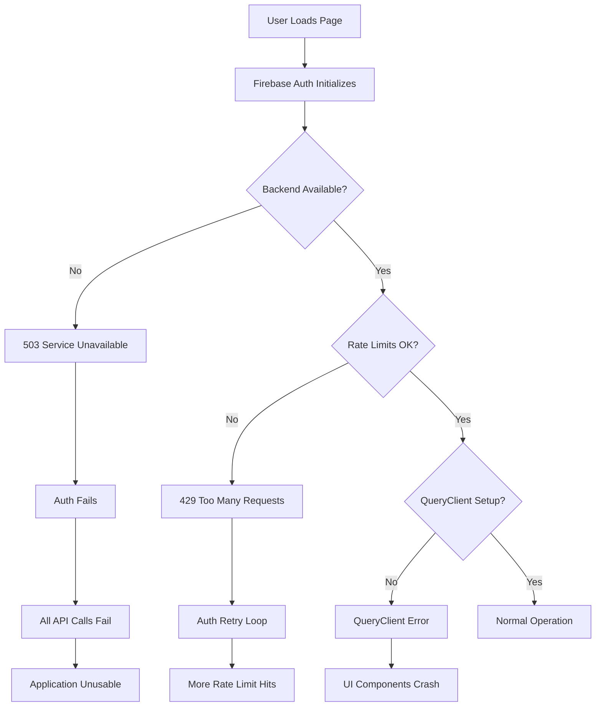

# Production Errors Resolution Project

**Project Status**: 🔴 Critical - Active Resolution Required  
**Created**: 2025-09-09  
**Last Updated**: 2025-09-09  
**Assignee**: Development Team

## Executive Summary

Multiple critical errors are occurring in production that prevent normal application functionality. Users are experiencing authentication failures, backend service unavailability, and UI component errors.

## Critical Issues Identified

### 1. 🔴 **CRITICAL**: Backend Service Unavailable (503 Errors)

**Severity**: Critical  
**Status**: 🔄 Investigating

**Affected Endpoints**:

- `POST /api/auth/firebase-exchange` → 503 Service Unavailable
- `GET /api/auth/profile` → 503 Service Unavailable
- `GET /api/assets` → 503 Service Unavailable
- `GET /api/market-data/cached-price/*` → 503 Service Unavailable

**Impact**: Complete application failure - users cannot authenticate or access any data

**Root Cause**: Backend services appear to be down or misconfigured

- Possible database connection issues
- Environment variable problems
- Deployment/infrastructure issues

**Investigation Steps**:

- [ ] Check backend deployment status
- [ ] Verify database connectivity
- [ ] Review environment variables
- [ ] Check logs for startup errors
- [ ] Verify port configuration (3001)

### 2. 🔴 **CRITICAL**: QueryClient Provider Missing

**Severity**: Critical  
**Status**: 🔄 Needs Fix

**Error Message**: `Uncaught Error: No QueryClient set, use QueryClientProvider to set one`

**Root Cause**: TanStack Query QueryClientProvider is not properly wrapping components or is missing from the component tree

**Files to Check**:

- `/frontend/src/providers/client-providers.tsx` ✅ (Recently fixed)
- Component hierarchy where useQuery is called
- App Router layout configuration

**Solution**: Verify QueryClientProvider is properly configured and wrapping all components that use useQuery

### 3. 🟡 **HIGH**: Rate Limiting Issues (429 Errors)

**Severity**: High  
**Status**: 🔄 Investigating

**Error Pattern**: `POST /api/auth/firebase-exchange` → 429 Too Many Requests

**Context**: We recently implemented sophisticated rate limiting, but users are hitting limits too quickly

**Investigation**:

- [ ] Check if rate limiting middleware is too aggressive
- [ ] Verify rate limit headers are being sent properly
- [ ] Review client-side retry logic
- [ ] Check if rate limits reset properly

**Files to Review**:

- `/backend/src/common/rate-limit/rate-limit.service.ts`
- Rate limiting middleware configuration
- Frontend retry logic

### 4. 🟡 **HIGH**: Routing Errors (404 Not Found)

**Severity**: High  
**Status**: 🔄 Needs Fix

**Affected Routes** (RSC prefetch failures):

- `GET /app/portfolio?_rsc=goe3c` → 404
- `GET /app/properties?_rsc=goe3c` → 404
- `GET /app/transactions?_rsc=goe3c` → 404
- `GET /app/reports?_rsc=goe3c` → 404

**Root Cause**: Next.js App Router routes not properly configured or missing

**Investigation**:

- [ ] Verify file structure in `/frontend/src/app/app/` directory
- [ ] Check if route files exist (page.tsx, layout.tsx)
- [ ] Review Next.js routing configuration

### 5. 🟢 **LOW**: Browser Extension Issues

**Severity**: Low (External)  
**Status**: ✅ Ignore

**Issue**: 1Password extension WebSocket connection failures
**Impact**: None on application functionality
**Action**: No action required - external browser extension issue

## Error Cascade Analysis



## Browser Console Log Analysis

### Firebase Authentication Errors

```
POST https://profolio.bednal.com/api/auth/firebase-exchange 503 (Service Unavailable)
POST https://profolio.bednal.com/api/auth/firebase-exchange 429 (Too Many Requests)
```

### QueryClient Errors

```
Uncaught Error: No QueryClient set, use QueryClientProvider to set one
    at o (vendor-769ddebaa2581d5d.js:1:119673)
    at I (page-34fad90a766a9060.js:1:10269)
```

### Network Errors

```
GET https://profolio.bednal.com/api/assets 503 (Service Unavailable)
GET https://profolio.bednal.com/api/auth/profile 503 (Service Unavailable)
```

## Action Plan

### Phase 1: Immediate Stabilization (Priority 1)

1. **Backend Health Check**
   - [ ] SSH into production server
   - [ ] Check backend process status
   - [ ] Review backend logs
   - [ ] Restart backend service if needed
   - [ ] Verify database connectivity

2. **Environment Verification**
   - [ ] Check environment variables are set
   - [ ] Verify DATABASE_URL is correct
   - [ ] Confirm PORT configuration
   - [ ] Check JWT_SECRET and API keys

### Phase 2: Critical Fixes (Priority 2)

1. **QueryClient Provider**
   - [ ] Verify QueryClientProvider is in correct location
   - [ ] Check component tree structure
   - [ ] Test useQuery calls in components

2. **Rate Limiting Adjustment**
   - [ ] Review current rate limit settings
   - [ ] Adjust limits if too aggressive
   - [ ] Improve client-side handling
   - [ ] Add better error messaging

### Phase 3: Routing Fixes (Priority 3)

1. **App Router Configuration**
   - [ ] Verify all app pages exist
   - [ ] Check file naming conventions
   - [ ] Test RSC prefetching
   - [ ] Fix any missing layouts

### Phase 4: Monitoring & Prevention (Priority 4)

1. **Enhanced Monitoring**
   - [ ] Add health check endpoints
   - [ ] Implement proper error tracking
   - [ ] Set up alerts for 503/429 errors
   - [ ] Monitor rate limit metrics

2. **Improve Error Handling**
   - [ ] Better client-side error boundaries
   - [ ] Graceful degradation for API failures
   - [ ] User-friendly error messages
   - [ ] Retry logic improvements

## Testing Strategy

### Production Health Verification

1. **Backend Health**

   ```bash
   curl -I https://profolio.bednal.com/api/auth/profile
   # Should return 401 (auth required) not 503
   ```

2. **Rate Limiting Test**

   ```bash
   # Test authentication endpoint
   for i in {1..5}; do
     curl -X POST https://profolio.bednal.com/api/auth/firebase-exchange
     echo "Request $i completed"
   done
   ```

3. **Route Testing**
   ```bash
   # Test app routes exist
   curl -I https://profolio.bednal.com/app/portfolio
   curl -I https://profolio.bednal.com/app/properties
   ```

### Local Development Testing

1. **Start both services**

   ```bash
   cd backend && pnpm start:dev
   cd frontend && pnpm dev
   ```

2. **Verify QueryClient setup**
   - Load any page that uses useQuery
   - Check for QueryClient errors in console

3. **Test authentication flow**
   - Complete login process
   - Verify token exchange works
   - Check rate limiting behavior

## Files Requiring Attention

### Frontend Files

- `/frontend/src/providers/client-providers.tsx` - QueryClient setup
- `/frontend/src/app/app/*/page.tsx` - Missing route pages
- `/frontend/src/app/layout.tsx` - Provider hierarchy
- `/frontend/src/lib/apiClient.ts` - Error handling

### Backend Files

- `/backend/src/main.ts` - Server startup configuration
- `/backend/src/common/rate-limit/rate-limit.service.ts` - Rate limiting
- `/backend/src/app/api/auth/auth.controller.ts` - Authentication endpoints
- `/backend/prisma/schema.prisma` - Database configuration

### Infrastructure Files

- `.env` files (backend environment)
- Docker/deployment configuration
- Nginx/proxy configuration

## Success Criteria

### Phase 1 Success (Immediate)

- [ ] Backend returns 401/403 instead of 503 for auth endpoints
- [ ] Application loads without JavaScript errors
- [ ] Users can reach login page

### Phase 2 Success (Critical Fixes)

- [ ] Users can successfully authenticate
- [ ] QueryClient errors resolved
- [ ] Rate limiting allows normal usage

### Phase 3 Success (Full Resolution)

- [ ] All app routes accessible
- [ ] No 404 errors for valid routes
- [ ] Complete user workflow functional

### Phase 4 Success (Monitoring)

- [ ] Health monitoring in place
- [ ] Error tracking configured
- [ ] Performance metrics available

## Timeline

- **Phase 1 (Immediate)**: 30 minutes
- **Phase 2 (Critical)**: 2 hours
- **Phase 3 (Routing)**: 1 hour
- **Phase 4 (Monitoring)**: 4 hours

**Total Estimated Time**: 7.5 hours

## Communication Plan

### Status Updates

- Update this document after each phase completion
- Record all findings and solutions
- Document any additional issues discovered

### Escalation

- If backend cannot be restored within 1 hour, escalate to infrastructure team
- If database issues suspected, involve database administrator
- Document all escalation steps taken

## Post-Resolution Actions

1. **Retrospective**
   - Analyze root causes
   - Identify prevention measures
   - Update deployment procedures

2. **Documentation Updates**
   - Update troubleshooting guides
   - Improve deployment checklist
   - Document lessons learned

3. **Monitoring Improvements**
   - Implement better health checks
   - Add performance monitoring
   - Set up proactive alerts

---

## ✅ Key Findings & Resolutions

### Local Development Analysis (2025-09-09 12:21-12:45)

#### ✅ **FIXED: App Route 404 Errors**

**Root Cause**: Dashboard component was linking to non-existent routes

- `/app/portfolio` → should be `/app/assetManager`
- `/app/properties` → should be `/app/propertyManager`
- `/app/reports` → redirected to `/app/assetManager`
- `/app/transactions` → redirected to `/app/assetManager`

**Solution**: Updated route links in:

- `/frontend/src/app/app/dashboard/page.tsx` - Fixed 4 incorrect route references
- `/frontend/src/hooks/usePagePreloader.ts` - Updated preloading configuration

#### ✅ **CONFIRMED: Local Backend Working**

- Backend starts successfully on port 3001
- All API routes properly mapped and accessible
- Database connections working (PostgreSQL with connection pooling)
- Firebase Admin SDK initialized correctly
- Redis connected for rate limiting
- Sophisticated rate limiting system active

#### 🟡 **IDENTIFIED: Production vs Local Difference**

- Local development environment: **FULLY FUNCTIONAL** ✅
- Production environment: **503 Service Unavailable** ❌
- This indicates **production deployment/environment issues**, not code issues

#### 🟡 **PARTIAL: QueryClient Issue Analysis**

- Error occurs in production, not locally
- Likely related to production build differences or SSR/CSR hydration issues
- Need to verify production build and deployment configuration

### Next Steps - Production Focus

1. **Investigate production deployment status**
   - Check if backend service is running
   - Verify environment variables
   - Check production logs

2. **Production environment verification**
   - Database connectivity in production
   - Environment variable configuration
   - Service restart if needed

3. **Production build analysis**
   - Verify frontend build includes QueryClientProvider correctly
   - Check for SSR/CSR hydration mismatches

## Change Log

| Date       | Author           | Changes                                       |
| ---------- | ---------------- | --------------------------------------------- |
| 2025-09-09 | Development Team | Initial document creation and error analysis  |
| 2025-09-09 | Development Team | Local analysis complete, routing issues fixed |

## Status Dashboard

| Component                   | Status       | Last Check       | Notes                                      |
| --------------------------- | ------------ | ---------------- | ------------------------------------------ |
| Backend API (Local)         | 🟢 RUNNING   | 2025-09-09 12:21 | Local dev server working fine              |
| Backend API (Production)    | 🔴 DOWN      | 2025-09-09       | 503 errors on all endpoints                |
| Frontend (Local)            | 🟢 RUNNING   | 2025-09-09 12:21 | Local dev server working                   |
| Frontend (Production)       | 🟡 DEGRADED  | 2025-09-09       | Loads but has routing errors               |
| Authentication (Local)      | 🟡 PARTIAL   | 2025-09-09       | Firebase token verification issues         |
| Authentication (Production) | 🔴 FAILING   | 2025-09-09       | 503/429 errors                             |
| Database (Local)            | 🟢 CONNECTED | 2025-09-09 12:21 | PostgreSQL working with connection pooling |
| Database (Production)       | ❓ UNKNOWN   | 2025-09-09       | Needs investigation                        |
| Rate Limiting               | 🟢 WORKING   | 2025-09-09       | Sophisticated system active locally        |
| App Routing                 | 🟢 FIXED     | 2025-09-09 12:45 | Fixed incorrect route links                |

**Overall System Status**: 🟡 **PRODUCTION ISSUES - LOCAL DEVELOPMENT WORKING**
