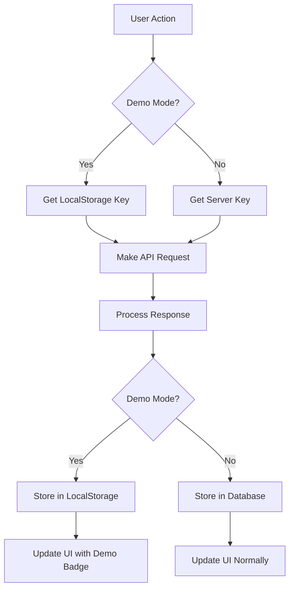

# 🧪 Demo Mode Guide

Demo Mode allows you to safely test API integrations without storing sensitive credentials on the server. Perfect for development, testing, and exploring Profolio's features.

## 📋 **Overview**

Demo Mode provides:
- **Safe API Testing** - No server-side credential storage
- **Full Feature Access** - Complete portfolio functionality
- **Local Storage Only** - Credentials stored in browser localStorage
- **Automatic Cleanup** - All data cleared on logout

---

## 🎯 **When to Use Demo Mode**

### ✅ **Perfect For:**
- Testing new API integrations
- Exploring Profolio features safely
- Development and debugging
- Temporary portfolio analysis
- Training and demonstrations

### ❌ **Not Recommended For:**
- Production portfolio management
- Long-term data storage
- Shared/public computers
- Permanent investment tracking

---

## 🚀 **Quick Setup**

### **Step 1: Enable Demo Mode**
```bash
1. Open Profolio in your browser
2. Go to Settings → Security
3. Toggle "Demo Mode" ON
4. Confirm the security notice
```

### **Step 2: Add Demo API Keys**
```bash
1. Go to Settings → API Keys
2. Notice the "DEMO MODE" indicator
3. Add your Trading 212 API key
4. Credentials stored in localStorage only
```

### **Step 3: Test Integration**
```bash
1. Navigate to Portfolio → Sync
2. Click "Sync Now" to test API
3. Verify data loads correctly
4. Check no server storage occurred
```

---

## 🔒 **Security Features**

### **Local Storage Only**
```javascript
// Demo mode storage (browser only)
localStorage.setItem('demo-api-keys', JSON.stringify({
  trading212: 'your_encrypted_key_here',
  provider: 'demo',
  expires: Date.now() + (24 * 60 * 60 * 1000) // 24 hours
}));

// No server communication for credentials
// No database storage
// No network transmission of keys
```

### **Automatic Expiration**
- **Session Expiry:** Demo data expires with browser session
- **Time Limit:** 24-hour maximum for security
- **Manual Clear:** Clear anytime via "Clear Demo Data"
- **Logout Cleanup:** Automatic cleanup on logout

### **Security Indicators**
- **Visual Warnings:** Clear "DEMO MODE" indicators throughout UI
- **Data Badges:** All demo data clearly marked
- **Expiry Notices:** Countdown timers for demo sessions
- **Security Reminders:** Regular prompts about demo limitations

---

## 🛠️ **Implementation Details**

### **Storage Architecture**
```typescript
interface DemoStorage {
  apiKeys: {
    [provider: string]: {
      key: string;
      encrypted: boolean;
      expires: number;
    };
  };
  portfolioData: {
    positions: Position[];
    transactions: Transaction[];
    cached: Date;
    source: 'demo';
  };
  settings: {
    demoMode: true;
    warnings: boolean;
    autoExpire: number;
  };
}
```

### **API Request Flow**


### **Data Isolation**
- **Separate Storage:** Demo data never touches server database
- **Clear Boundaries:** Distinct data models for demo vs production
- **No Mixing:** Impossible to accidentally combine demo and real data
- **Safe Defaults:** All operations default to safe demo behavior

---

## 📊 **Demo Data Management**

### **Data Lifecycle**
1. **Creation:** API keys stored in localStorage on first use
2. **Usage:** Normal portfolio operations with demo indicators
3. **Persistence:** Data survives browser refresh, not browser close
4. **Expiration:** Automatic cleanup after 24 hours or logout
5. **Cleanup:** Manual clear option always available

### **Storage Limits**
- **API Keys:** 10MB localStorage limit (practically unlimited)
- **Portfolio Data:** Cached for performance, cleared on expiry
- **Session Data:** Temporary cache for current session only
- **No File Storage:** No downloads or permanent files created

### **Demo Data Export**
```bash
# Export demo portfolio data
1. Go to Portfolio → Export
2. Select "Demo Data Export"
3. Download JSON/CSV of current demo session
4. Data includes demo disclaimers
```

---

## 🎮 **Testing Scenarios**

### **API Integration Testing**
```javascript
// Test different API scenarios
const testScenarios = [
  {
    name: 'Valid API Key',
    key: 'demo-valid-key-123',
    expected: 'successful_portfolio_sync'
  },
  {
    name: 'Invalid API Key', 
    key: 'demo-invalid-key',
    expected: '401_authentication_error'
  },
  {
    name: 'Rate Limited Key',
    key: 'demo-rate-limited',
    expected: '429_rate_limit_error'
  }
];
```

### **Feature Testing**
- **Portfolio Sync:** Test real-time data updates
- **Transaction Import:** Import historical data
- **Performance Analytics:** Generate reports and charts
- **Risk Analysis:** Test portfolio analysis features
- **Export Functions:** Test data export capabilities

### **Error Handling**
- **Network Errors:** Disconnect internet, test offline behavior
- **API Errors:** Use invalid keys to test error displays
- **Rate Limits:** Test rate limiting behavior
- **Data Corruption:** Test recovery from bad data

---

## 🔧 **Development Setup**

### **Local Development**
```bash
# Enable demo mode for development
export DEMO_MODE=true
npm run dev:frontend
npm run dev:backend

# Demo mode automatically enabled
# No server-side credential storage
# Safe for development testing
```

### **Demo Mode Configuration**
```typescript
// frontend/src/config/demo.ts
export const demoConfig = {
  enabled: process.env.DEMO_MODE === 'true',
  storage: {
    keyPrefix: 'profolio-demo-',
    expiry: 24 * 60 * 60 * 1000, // 24 hours
    maxSize: 10 * 1024 * 1024 // 10MB
  },
  security: {
    showWarnings: true,
    autoExpire: true,
    clearOnLogout: true
  }
};
```

### **Testing API Keys**
```bash
# Use these demo keys for testing
TRADING212_DEMO_KEY="demo-token-secure-123"
TRADING212_INVALID_KEY="demo-invalid-token"
TRADING212_RATE_LIMITED="demo-rate-limited-token"

# These trigger specific test behaviors
# Safe to use in development
# No real API calls made
```

---

## ⚠️ **Important Limitations**

### **Security Warnings**
- **Browser Storage:** Vulnerable to XSS attacks
- **Shared Computers:** Anyone with browser access can see demo data
- **No Encryption:** LocalStorage is not encrypted by browser
- **Session Sharing:** Multiple tabs share same demo session

### **Functionality Limits**
- **No Persistence:** Data lost on browser closure
- **No Backup:** No server-side backup of demo data
- **Limited History:** No long-term historical data storage
- **No Sync:** Cannot sync across devices

### **Best Practices**
- **Use Test Keys:** Never use real API keys in demo mode
- **Clear Data:** Always clear demo data when done
- **Private Browsing:** Use incognito mode for extra security
- **Limited Time:** Don't rely on demo mode for important data

---

## 🚨 **Troubleshooting**

### **Common Issues**

#### **Demo Data Not Saving**
```bash
# Check localStorage availability
if (typeof(Storage) !== "undefined") {
  console.log("LocalStorage available");
} else {
  console.log("LocalStorage not supported");
}

# Clear browser cache if storage full
localStorage.clear();
```

#### **API Calls Failing**
```bash
# Verify demo mode is enabled
console.log("Demo mode:", localStorage.getItem('demo-mode'));

# Check API key format
console.log("Demo keys:", JSON.parse(localStorage.getItem('demo-api-keys')));
```

#### **Data Not Clearing**
```bash
# Manual cleanup
localStorage.removeItem('demo-api-keys');
localStorage.removeItem('demo-portfolio-data');
localStorage.removeItem('demo-settings');

# Or clear all demo data
localStorage.clear();
```

### **Recovery Options**
- **Refresh Browser:** Reload page to reset demo session
- **Clear Storage:** Use browser dev tools to clear localStorage
- **Restart Session:** Logout and login again
- **Disable Demo Mode:** Switch to production mode

---

## 📚 **Related Documentation**

- [API Integration Guide](../api-integration.md) - Full API setup guide
- [Security Policy](../../SECURITY.md) - Security best practices
- [Development Setup](../../CONTRIBUTING.md) - Development environment
- [Trading 212 Integration](../api-integration.md#trading-212-integration) - Specific Trading 212 setup

---

**Questions?** Demo mode is designed to be safe and easy to use. If you encounter any issues, please open a [GitHub issue](https://github.com/Obednal97/profolio/issues) with the `demo-mode` label. 